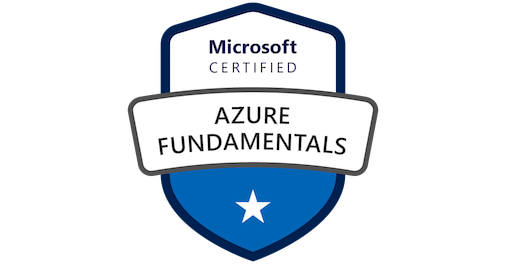
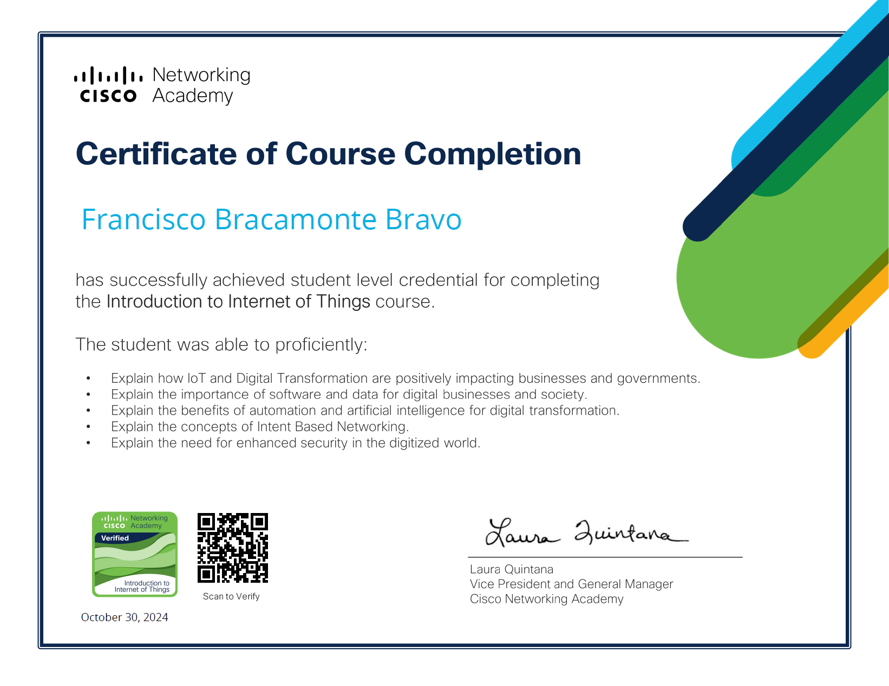

<div align="center">
  
# 👋 ¡Hola! Soy Francisco Bracamonte Bravo

### Desarrollador de Software | Inteligencia Artificial | Big Data

[](https://www.linkedin.com/in/francisco-bracamonte-bravo-251908205)
[](https://github.com/Franbbbm)
[](https://cv-francisco-rho.vercel.app)
[](mailto:franbbbm@gmail.com)

</div>

---

## 🚀 Sobre Mí
```python
class FranciscoBracamonte:
    def __init__(self):
        self.location = "Madrid, España 🇪🇸"
        self.role = "AI Developer & Data Scientist"
        self.currently_learning = ["LLMs", "MLOps", "Cloud Architecture"]
        self.specialties = ["Machine Learning", "NLP", "Big Data", "Full Stack"]
        
    def get_current_focus(self):
        return {
            "🎯 Focus": "Optimización y despliegue de modelos de IA",
            "💡 Passion": "Llevar prototipos de ML a producción"
        }
```

---

## 🛠️ Tech Stack

### 🤖 Inteligencia Artificial & Machine Learning

<p align="left">


</p>

### 📊 Data Science & Analytics

<p align="left">


</p>

### 💻 Lenguajes de Programación

<p align="left">


</p>

### ☁️ DevOps & Cloud

<p align="left">


</p>

### 🗄️ Bases de Datos

<p align="left">


</p>

### 🌐 Web Development

<p align="left">


</p>

---

## 💼 Experiencia & Proyectos

### 🎯 Áreas de Especialización

<table>
<tr>
<td width="33%" align="center">

**🤖 NLP & LLMs**

Fine-tuning de modelos
Optimización de prompts
Transformers & Embeddings
Hugging Face

</td>
<td width="33%" align="center">

**📊 MLOps**

Docker & Kubernetes
Despliegue en Azure/AWS
CI/CD para ML
Monitorización de modelos

</td>
<td width="33%" align="center">

**🔧 Automatización**

Scripts Python/Bash
APIs REST
ETL Pipelines
Process Optimization

</td>
</tr>
</table>

---

## 🎓 Certificaciones

<div align="center">

### 📜 Credenciales Profesionales Verificadas

<br/>

| Azure Fundamentals | IA Generativa | .NET Framework |
|:------------------:|:-------------:|:--------------:|
| <a href="URL_VERIFICACION_AZURE"></a> | <a href="URL_VERIFICACION_IA"></a> | <a href="URL_VERIFICACION_DOTNET"></a> |
|  |  |  |

<br/>

| Introduction to IoT | JavaScript Avanzado | TypeScript |
|:-------------------:|:-------------------:|:----------:|
| <a href="URL_VERIFICACION_IOT"></a> | <a href="URL_VERIFICACION_JS"></a> | <a href="URL_VERIFICACION_TS"></a> |
|  |  |  |

<br/>

<details>
<summary><b>📚 Ver Certificaciones Adicionales</b></summary>

<br/>

| JavaScript Intermedio | JavaScript Principiantes | jQuery |
|:---------------------:|:------------------------:|:------:|
|  |  |  |

</details>

</div>

---

## 📫 Conecta Conmigo

<div align="center">

[](www.linkedin.com/in/francisco-bracamonte-bravo-251908205)
[](mailto:franbbbm@gmail.com)
[](https://cv-francisco-rho.vercel.app)


</div>
